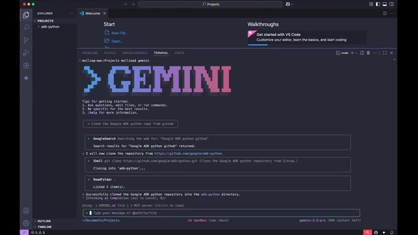

# Inside the Agent Factory: Why I’m Sold on Gemini CLI

**By Molly Pettit**

I’m not gonna lie—my "read later" folder has its own gravitational pull. I’m not great at sitting down and digesting massive amounts of documentation. That’s why our latest episode of *The Agent Factory* was such a lightbulb moment for me.

We sat down with **Taylor Mullin**, the creator of Gemini CLI, to dig into why this tool is becoming indispensable for developers (and yes, even marketers and financiers).

*The Gemini CLI agentic loop in action: reasoning, choosing tools, and executing commands.*

## The "Too Early" Paradox

One of the most fascinating things Taylor shared was the origin story. Believe it or not, the concept for Gemini CLI started a year and a half ago. But back then? It was scrapped.

> "It took a minute and a half to respond to anything... It was almost a little bit too early." — Taylor Mullin

Fast forward to today, and the ecosystem has caught up. Developers are ready for tools that might take a beat to think if it means they produce high-quality, complex results. And the results *are* high quality.

## Trust Through Transparency

We talked a lot about the decision to make Gemini CLI open source. Taylor was adamant that this wasn't just a "nice to have"—it was essential for security and trust.

When you have an agent running on your machine, with access to your files and terminal, you need to know exactly what it's doing. By building in the open, the team ensures that there are no "black boxes."

## The "Meta" Moment: AI Building AI

My favorite part of the demo? Hearing how the CLI actually writes its own code. Taylor shared a story about needing a markdown parser early in development. Instead of hunting for a library, he asked the CLI what his options were.

Its response? *"I can write a markdown parser for you."*

*Taylor explaining how the CLI wrote its own markdown rendering engine.*

And it did. That code is still running in the tool today. That’s the difference between 10x-ing yourself (which is "easy" now, according to Taylor) and **100x-ing** yourself.

## Final Thoughts

I’ve been using the CLI for a few weeks now, and it’s already a mainstay in my workflow. The fact that it lives in my terminal, integrates with VS Code, and can "self-heal" when it hits errors makes it feel less like a tool and more like a partner.

If you haven't tried it yet, check it out on GitHub. It might just save you from your own "read later" folder.
